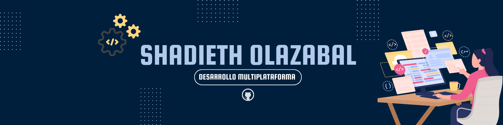

# 👋🏻 ¡Hola! Soy **Shadi** 👩🏻‍💻

## 🎓 Estudiante de Desarrollo de Aplicaciones Multiplataforma 📲 
Estoy en formación como desarrolladora de aplicaciones multiplataforma, adquiriendo habilidades para diseñar y desarrollar soluciones digitales modernas y eficientes.  

## 💻 Proyectos en crecimiento  
En mi **GitHub**, encontrarás una colección de proyectos desarrollados como parte de mi aprendizaje académico, entre otros poyectos personales o de mi formación en prácticas.

## 🤝🏻 Conéctate conmigo  
🌐 [LinkedIn](https://www.linkedin.com/in/shadieth-olazabal-coro)  
✉️ [shadieth@yahoo.com](mailto:shadieth@yahoo.com)  
